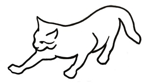
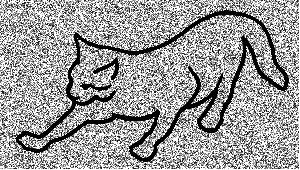
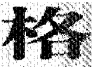
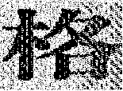
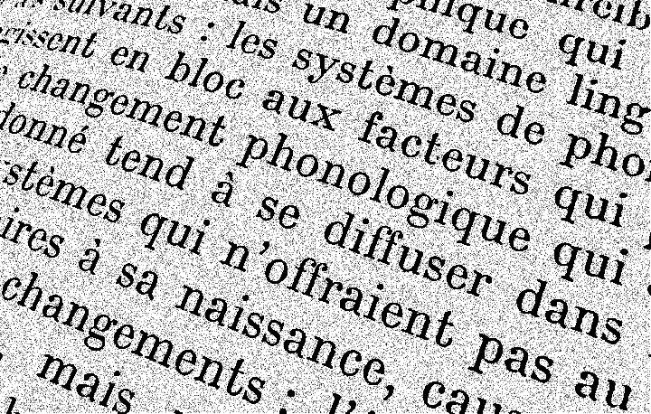
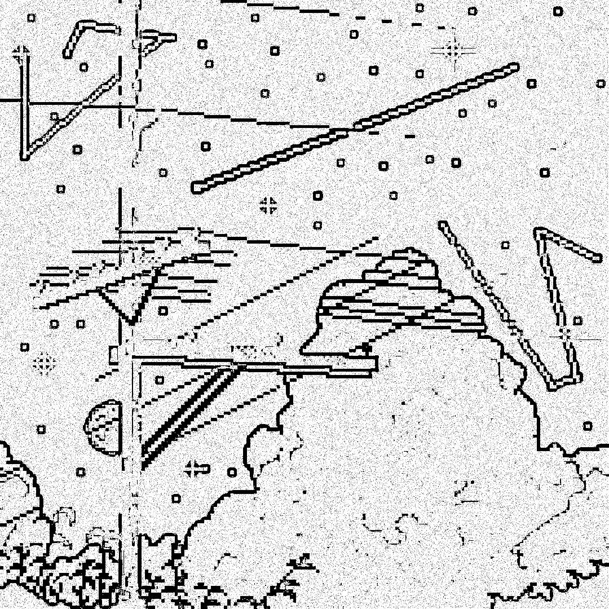

# Лабораторная работа №3

## Тема: Фильтрация изображений и морфологические операции

|**Студент:**|*Вудвуд Андрей*|
|------------|--------------|
|**Группа:** |*Б22-564*     |
|**Вариант:**|*19*           |
---

## Примеры

1. [Котик - малым шума](#ex1)
2. [Котик - немного шума](#ex2)
3. [Котик - инвертированный](#ex3)
4. [Котик - инвертированный](#ex4)
5. [Другой котик - немного шума](#ex5)
6. [Иероглиф](#ex6)
7. [Спираль](#ex7)
8. [Текст](#ex8)
9. [Пиксель-арт](#ex9)

## План

---

- ### Задание №1: Морфологическое сжатие (эрозия). Структурирующий элемент — диск 3×3

- ### Задание №2: Разностное изображение (попиксельный xor или модуль разности)

---

<a name="ex1"> <h2>Пример №1</h2> </a>

- #### Исходное изображение

    

- #### Изображение с шумом и перцем

    

- #### Эрозия

    

- #### Разностное изображение

    

---

<a name="ex2"> <h2>Пример №2</h2> </a>

- #### Исходное изображение

    

- #### Изображение с шумом и перцем

    

- #### Эрозия

    

- #### Разностное изображение

    

---

<a name="ex3"> <h2>Пример №3</h2> </a>

- #### Исходное изображение

    

- #### Изображение с шумом и перцем

    

- #### Эрозия

    

- #### Разностное изображение

    

---

---

<a name="ex5"> <h2>Пример №5</h2> </a>

- #### Исходное изображение

    

- #### Изображение с шумом и перцем

    

- #### Эрозия

    

- #### Разностное изображение

    

---

<a name="ex6"> <h2>Пример №6</h2> </a>

- #### Исходное изображение

    

- #### Изображение с шумом и перцем

    

- #### Эрозия

    

- #### Разностное изображение

    

---

<a name="ex7"> <h2>Пример №7</h2> </a>

- #### Исходное изображение

    

- #### Изображение с шумом и перцем

    

- #### Эрозия

    

- #### Разностное изображение

    

---

<a name="ex8"> <h2>Пример №8</h2> </a>

- #### Исходное изображение

    

- #### Изображение с шумом и перцем

    

- #### Эрозия

    

- #### Разностное изображение

    

---

<a name="ex9"> <h2>Пример №9</h2> </a>

- #### Исходное изображение

    

- #### Изображение с шумом и перцем

    

- #### Эрозия

    

- #### Разностное изображение

    